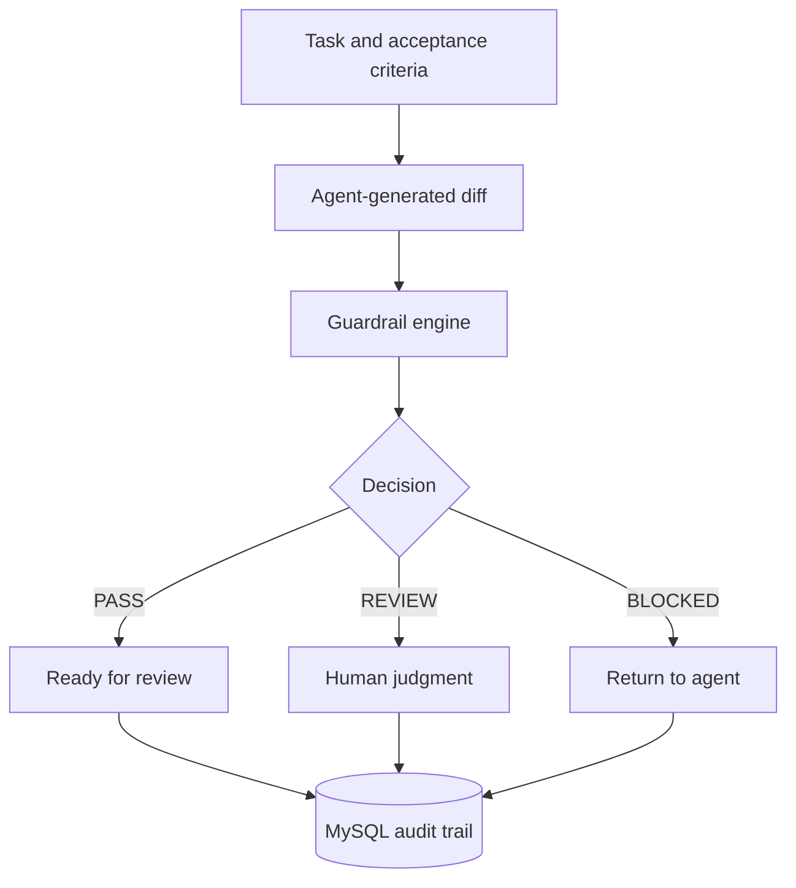

# AgentGuard Workbench

[](https://github.com/samiha-khan/agentguard-workbench/actions/workflows/ci.yml)

AgentGuard reviews code changes produced with coding agents. It takes a task, its acceptance criteria, a Git diff, and the test result, then returns one of three outcomes: `PASS`, `REVIEW`, or `BLOCKED`.

I built it to explore a question I kept running into while using coding agents: once an agent finishes a change, what evidence should I check before accepting it? The first version focuses on checks that are predictable and easy to audit instead of asking another model to judge the code.


A change that adds a hard-coded key and edits a migration is blocked. Each finding and score deduction is listed, and every run is saved.

## How it works

1. Describe the task and the conditions that make it complete.
2. Paste the diff produced for the task.
3. Record whether the test suite passed.
4. Run the diff through the configured checks.
5. Save the result so previous runs can be reviewed later.



## Checks included

| Rule | Severity | Behavior |
|---|---|---|
| Secret scan | Blocker | Looks for credentials added directly to code |
| Protected path | Blocker | Stops changes to production infrastructure, migrations, or CI configuration |
| Test gate | Blocker | Stops the run when its test suite failed |
| Change size | Warning | Flags changes with more than 300 added lines |
| Test evidence | Warning | Flags a change when the diff contains no test file |

The checks are deterministic. The same input produces the same result, and every score deduction is shown in the response.

## Stack

- Java 17, Spring Boot, and Spring Data JPA
- MySQL with an H2 database for local development and tests
- React and TypeScript, built with Vite
- JUnit, MockMvc, and AssertJ on the backend; Vitest and Testing Library on the frontend
- Docker Compose and GitHub Actions

## Run locally

Backend:

```bash
mvn spring-boot:run
```

Frontend (second terminal):

```bash
cd frontend
npm install
npm run dev
```

Open `http://localhost:5173`. The API runs at `http://localhost:8080`.

To run the API with MySQL instead of H2:

```bash
docker compose up --build
```

## API example

```bash
curl -X POST http://localhost:8080/api/evaluations \
  -H 'Content-Type: application/json' \
  -d '{
    "taskTitle": "Add learner progress card",
    "acceptanceCriteria": "Show progress; handle empty state; include tests",
    "diffText": "+++ b/ProgressCard.test.tsx\n+test(\"empty state\", () => {})",
    "testsPassed": true
  }'
```

## Tests

```bash
mvn verify
cd frontend && npm test && npm run build
```

Backend (22 tests): every guardrail rule and its edge cases (removed lines are not flagged as added secrets, deleted protected files are caught, a test file is recognized by its path and not by the word "test"), the PASS / REVIEW / BLOCKED verdicts and scores, saving a run and reading it back, the 404 for an unknown run, and request validation.

Frontend (8 tests): the scorecard, the history list, a full submit-and-refresh flow, and the error paths for an unreachable or rejecting API.

The frontend reads its API address from `VITE_API_URL` and defaults to `http://localhost:8080`.

## Decisions and limitations

- Secret detection currently uses regular expressions. It is useful for obvious mistakes, but it does not replace a dedicated secret scanner.
- Test status is supplied with the request. A later version should read verified results from CI.
- JPA creates the local schema automatically. A deployed version should use versioned migrations.
- The score represents policy violations. It does not predict whether the code contains a bug.

## What I would add next

- Read pull-request diffs and checks directly from GitHub.
- Store policies in a repository configuration file.
- Compare acceptance criteria with changed behavior and report uncovered criteria.
- Add per-rule test datasets and regression metrics.

## License

MIT
